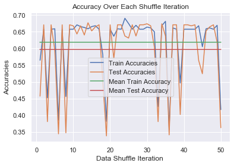

# Tech Report

### Defined Prediction Task with Metrics For Success ###

We would like to predict the class label of whether a couple generally sleeps separately (represented by 1) or sleeps together (represented by 0). Our metric for success is a test set accuracy of above 0.5 (random guessing). We defined this goal due to the cardinality of our dataset as well as the amount of missing data in important attributes. We hypothesize it will be difficult for models to pick up on distributions of features in the dataset to be able to perform above our given metric for success.

### Why did you use this statistical test or ML algorithm? Which other tests did you consider or evaluate? How did you measure success or failure? Why that metric/value? What challenges did you face evaluating the model? Did you have to clean or restructure your data? ###

We first decided to test the Naive Bayes Classification (NBC) algorithm as our first candidate model. This decision was based off the fact that NBC is a good baseline prediction algorithm, our dataset is mainy categorical, and it will directly answer our question of how well prediction model will pick up on the distributions of the features. NBC is known to be one of the most straightforward and fast classification algorithm, which is suitable for a large chunk of data; because it is usually used on larger datasets we were unsure of how well it would perform and for the most part expected it to predict class labels at an accuracy of at best random. Some other algorithms we are looking to consider are linear regression using stochastic gradient decent using different combinations of attributes to try and maximize average testing accuracy. As stated above our metric for success is accuracy and we use it because it is very interpretable in terms of our prediction class. We are also able to easily define success through an a comparison of predicted values to actual labels. The only real challenge we have in the evaluation of this model is that the runtime of our algorithm increases with the amount of iterations we have; in other words, the more 'sure' we want to be the more time it will take. We did have to to create dummy variables for each unique variable in each column in the data set. This included null values in each column as well to retain the maximum amount of data we could use in our model.

### What is your interpretation of the results? Are you satisfied with your prediction accuracy? For prediction projects, we expect you to argue why you got the accuracy/success metric you have. Intuitively, how do you react to the results? Are you confident in the results? ###

Over 50 iterations random shuffling the mean train accuracy of the NBC model as 0.625 and the test accuracy of 0.5995. This can be interpreted as using NBC we can expect the model to predict the sleeping arrangements of about six out of ten couples correctly. We were generally suprised at the performance of the NBC because of the size of our dataset. Looking at the visualization of accuracy of iteration however I would like to see how well the model performs over even more iterations to see if the mean accuracy for the test set would drastically change.

### For your visualization, why did you pick this graph? What alternative ways might you communicate the result? Were there any challenges visualizing the results, if so, what where they? Will your visualization require text to provide context or is it standalone (either is fine, but it's recognize which type your visualization is)? ###

We picked this graph to show the variation of our accuracy over the random shuffling of the data, the plot also displays mean accuracy for the test and train set for each iteration of the random shuffling overall. We could have used a confusion matrix to portray the overall results however these are sometimes an unacommodating visualization for those who are not accustommed to data science and machine learning topics. We really had no challenges visualizing our dat we used matplotlib which was very straight forward. This visualization could be standalone however I think it will be helpful for it to have text that specifies the mean value of the accuracy for the test and train accuracies.

### Full results + graphs (at least 1 stats/ml test and at least 1 visualization). You should push your visualizations to the /analysis_deliverable/visualizations folder in your repo. Depending on your model/test/project we would ideally like you to show us your full process so we can evaluate how you conducted the test! ###

Our naive bayes implementation can be found in the analysis deliverable directory. 

### If you did a machine learning model, why did you choose this machine learning technique? Does your data have any sensitive/protected attributes that could affect your machine learning model? ###

The data we used in the classifier does include what would traditionally be seen as protected attributes. So we plan to run the NBC without these and see the difference in the accuracies. There is an argument to be made that using these attributes is not harmful in the case of the NBC because it purely just counts how many of each attribute belongs to each label to eventually calculate the maximum likelihood of the label. 

## Further Directions ##
-Looking at more iterations of random shuffles of the data set to gain higher confidence in our average accuracy prediction.
-Test NBC without protected attributes
-Test and create other visualizations for our prediction task such as linear regression using stochastic gradient decent
